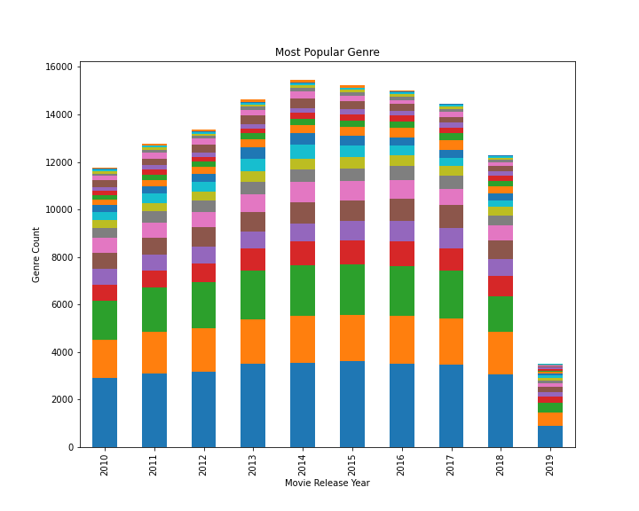
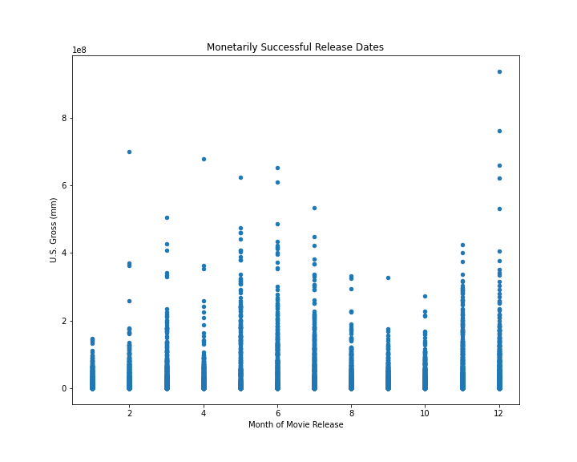
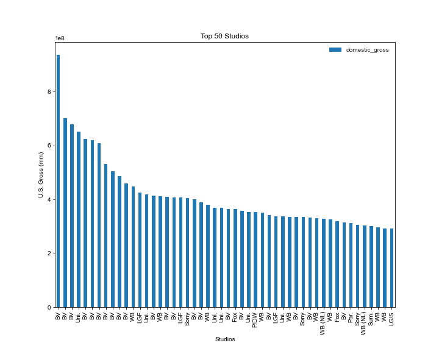

# Monetary Movie Industry Analysis

**Authors**: [Robert Reynoso](mailto:robert@birdstop.io)

## Overview

This project is an analysis into the movie industry. 
More espefically analysing the monetary success of films with respect to movie genres, realease dates,and movie studios in the United States. 

## Business Problem

The business problem for this project is a report on the movie industry that will allow Microsoft producers to make informed decisions in the creation of thier new movie stusio. In the U.S., success can be described through moneteray means. Thus given the available data sets (names used?)insights into how to maximize profit are shown using 3 seperate analysis. Throguh the data, we are able to see which movie genre makes the most profit, which month for a given movie release yields more profit, and which current studios have been most profitable.

## Data

* Within the movie industry data has been collected through individual companies such as IMDB, and Rotten Tomatoes.

* This available data mainly consists of text and integers. Pertaining to movie titles, genres, production budgets, etc. 

## Methods

* In this project, descriptive analysis was used. Including trends over time, and greatest count of specific categories.

* Using the Pandas Python library, data analysis and manipulation was carried out.

## Results
* From Analysis 1, the most popular movie genres from 2010 - 2019 have been Drama, Comedy, and Documentary

* From Analysis 2, the most monetarily successful release dates have been December and June.

* From Analysis 3, the top 50 movie studios in the U.S. have been Buena Vista and Universal Studios.  


### Analysis 1






## Conclusions

Given these analysis, 3 recommendations can be made:
1. In order to maximize revenue a studio should consider making movies within in the Drama, Comedy, and Documentary genres.

2. In order to maximize revenue a studio should consider releasing films in either December or June.

3. In order to maximize revenue a new studio should consider doing further research into Buena Vista and Universal Studios. In order to understand why these studios have been more successful than other studios in the U.S.

* The business problem for this project is a report on the movie industry that will allow Microsoft producers to make informed decisions in the creation of their new movie studio. 

* A successful film in the U.S. is one that yields maximum profit.

* Thus using these 3 analysis a producer can begin to make informed decisions into creating a new movie studio. 

## Next Steps

Further analysis could produce more accurate and current insights:

* Merging more data sets could yield more accurate information

* Design a new label for movies with multiple genres. Yielding more data, rather than dropping movies with multiple genres. 

* New investigation into what specifically made the top 50 studios more successful than other studios in the U.S.


## For More Information

Please review our full analysis in [our Jupyter Notebook](./Movie_Analysis.ipynb) or our [presentation](./Movie_Analysis.pdf).

For any additional questions, please contact **Robert Reynoso & robert@birdstop.io**

## Repository Structure


```
├── README.md                           <- The top-level README for reviewers of this project
├── Movie_Analysis.ipynb                <- Narrative documentation of analysis in Jupyter notebook
├── Movie_Analysis.pdf                  <- PDF version of project presentation
├── data                                <- Both sourced externally and generated from code
└── images                              <- Both sourced externally and generated from code
```
